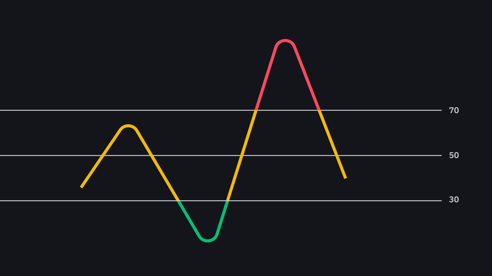

# RSI Trading Bot

This is a small project that serves as an introduction to trading bots with the very simple implementation of a strategy. 

This strategy is based on the Relative Strength Indicator (RSI). This indicator allows to know 2 things: the power of a trend and indicates if the market is overbought or oversold.

The classic RSi formula is as follows: RSI= 100 - [100/(1+H/B)]

With

H which is the average of the increases over the last X Units of Time.

B which is the average of the decreases during the X last X Units of Time.

The Strategy is pretty simple. If the market is Oversold, the bot is taking a position and selling it when it is Overbought. The default values of Oversold and Overbought are when the RSI is below 30 and above 70 :

  

The calculation of the RSI is done with the Ta-Lib library. The data are retrieved from the Binance websocket. To use the bot, you just have to enter the API keys of your Binance account and let it run.

Now let's try to backtest it. 
I used the Backtrader library on Python to test the strategy. I choosed a 2 week dataset (about 20 000 minutes) to test the strategy from 03/08/2020 to 17/08/2020.
Here are the results :

  

so the strategy loses with nearly $134 in losses over 2 weeks. Being a simple strategy, this is not surprising. I will now try to find a viable strategy that I will test on a several pairs of the same strategy.
